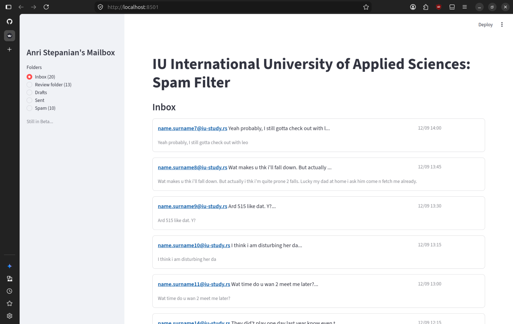
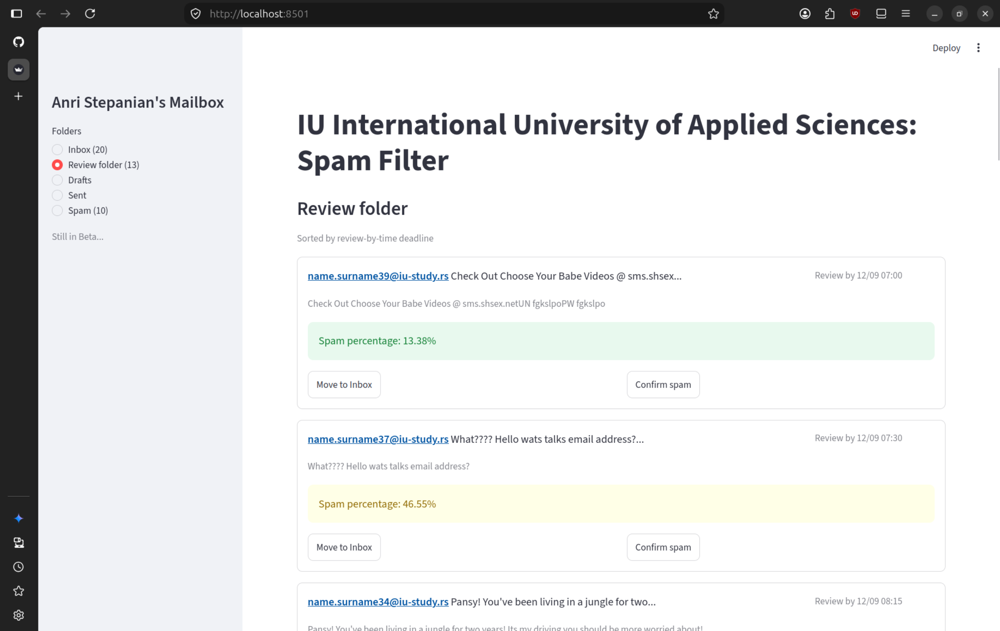
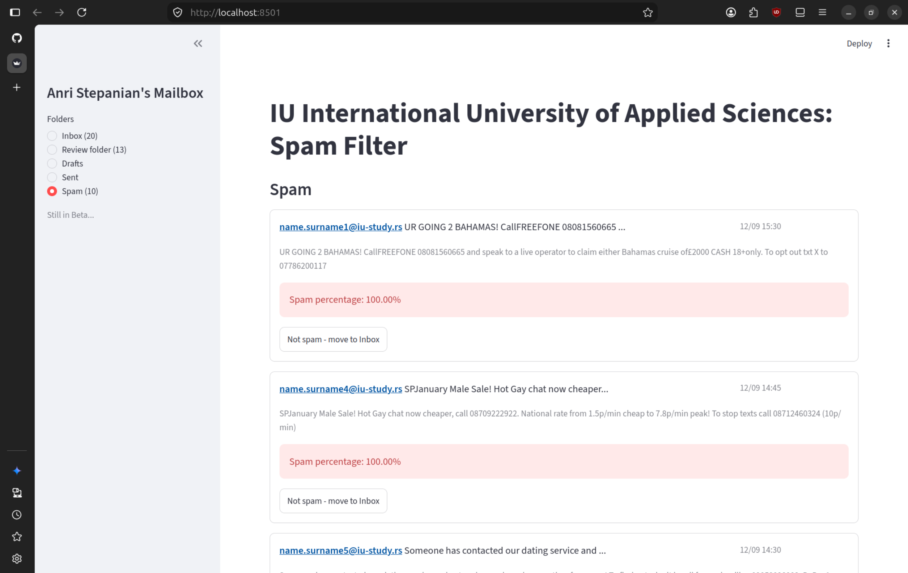

# Spam Filter app

## Case Study

In recent years the short messages communication has become ubiquitous for social interactions around the globe.
This applies both to private as well as professional sectors. The amount of spam messages has increased as well,
particularly on publicly available channels. Your company would like to install an open channel for some of their
products to enable fast and interactive feedback for their customers or possible future customers. You are the data
scientist in the company asked to support the service team with building a spam filter for this channel.<br><br>
Therefore, you are provided with a dataset compiled from different open-source datasets for short messages.
One request from the service team is that the model should allow for adjustments with respect to the risk of
allowing spam to pass, due to the huge variety of message quality that the (possible) customers provide. Therefore,
the spam filter should be adjustable via different spam-risk levels, e.g., “low-risk“ (very restrictive) and
„high-risk“ (not restrictive). The messages passing the “low-risk“-level are immediately displayed. The other ones
are moved to a folder for further analysis. You should also provide a strategy for further analysis, so as not to lose customers.

## Criteria

- The spam filter model was built using `Python version 3.12.13`.
- The code was documented using the `Sphinx (reStructuredText)` style.
- The *CRISP-DM* methodology was used to create the spam filter model.
- `Scikit-Learn` framework was used in order to build, train and test the ML model.
- `Streamlit` framework was used in order to create a GUI.
- `Jupyter Notebook` was used as an IDE during creation and training of the model.
- `PyCharm` was used as an IDE during creation of a REST API.

## User Action

- User can use the application as normal mail.

## Future Enhancements

Testing showed that a simple linear model has essentially hit its limit on this single-source 
dataset.<br><br>

- [x] Reach 96% F1-score on test data.
- [x] Implement a comprehensive GUI.
- [ ] Implement a CI/CD pipeline.
- [ ] Improve Model Architectures: Move beyond linear baselines to fine-tune transformer models, which capture context and subtle spam phrasing much better.
- [ ] Diversify Data: Add messages from other sources like live chat or website contact forms, so the model learns how real customers talk across different channels.
- [ ] Implement active Learning Loop: Add a feedback feature to the app, so that manual corrections made in the Review folder can be saved to retrain and improve the classifier over time.

## Installation

```commandline
pip install -r requirements.txt
```

## Usage

Start by installing the repository on your local machine.
> [!IMPORTANT]
> Since I didn't upload the trained models to GitHub you have to train them locally yourself

> [!WARNING]
> You have to execute this command from the **_main_** folder
<br>Run next:
```commandline
ipython
```
> [!NOTE]
> Now when you entered Ipython, you have to start training the model

```commandline
cd model_training
%run spam_filter_adjustemnt.ipynb
```
<br>Next, exit from Ipython:
```commandline
exit()
```
<br>Make sure you are in the main folder and run next:
```commandline
streamlit run main.py
```
> [!NOTE]
> If nothing happened, go to any browser and enter _http://localhost:8501/_ in search
<br>You should see working app with test data!<br>
<br>
<br>
<br>

## Results

This case study built a spam filter using the CRISP-DM approach. Since the data was
heavily imbalanced (87% ham vs. 13% spam), F1-score was tracked instead of plain accuracy
to judge the models fairly. Combining word-count features with a few engineered ones
(message length, digit count) and fixing a feature selection step that was cutting away useful
information, the tuned Logistic Regression model reached an F1-score of 96.1%.<br><br>
To put the model into practice, it was deployed through an interactive Streamlit app with
a tiered routing system. By setting specific probability thresholds and adding review timers (+1h,
+7h, +24h) for borderline messages, the app easily catches obvious spam (>85%) while making
sure real, legitimate messages aren't accidentally lost to false positives.<br><br>


## License

[Apache License](LICENSE)

## Authors

[Anri Stepanian 😎](https://github.com/anristepanian)
